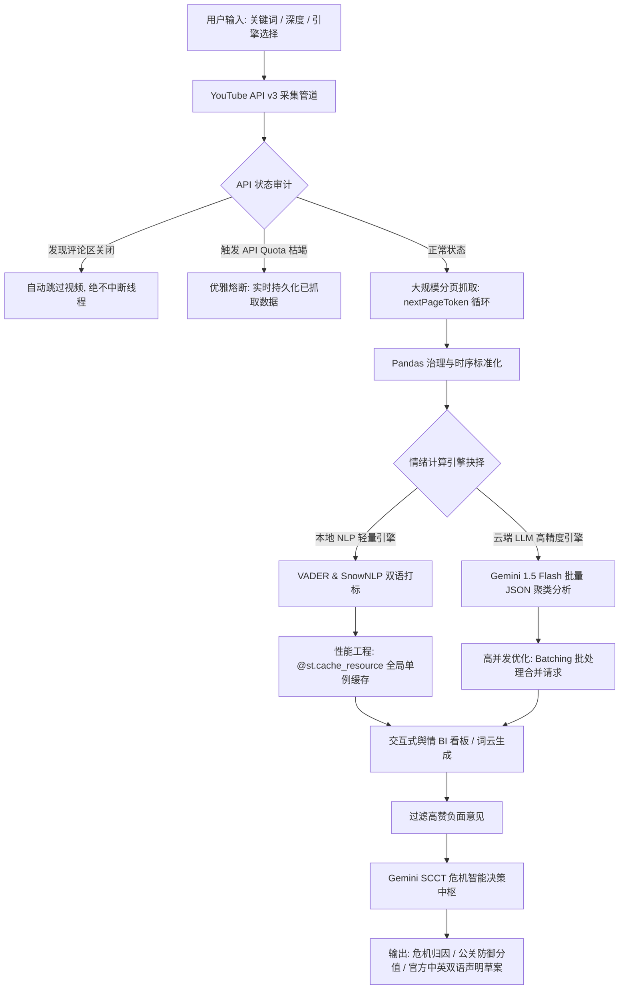

# 📊 YouTube Public Opinion Analysis & SCCT Crisis Decision System (跨区域品牌危机公关智能决策系统)

<p align="center">
  
  
  
  
  
</p>

---

## 🌟 English Abstract / 🎯 中文核心定位

**English:**
A production-grade, highly fault-tolerant **Micro-SaaS Platform** for multi-lingual public opinion tracking and corporate reputation management on YouTube. It bridges the gap between raw data and business intelligence by combining advanced text mining (VADER + SnowNLP) / Cloud LLMs (Gemini) with **Timothy Coombs' Situational Crisis Communication Theory (SCCT)** to automatically diagnose public relations crises, score corporate reputational risks, and generate bilingual official response statements.

**中文：**
一个专为品牌出海、跨境舆情声誉管理设计的**商业级微型 SaaS 决策看板**。系统打通了自 **“海量数据抓取 -> 时序清洗建模 -> AI 双引擎情绪标记 -> SCCT 危机公关研判与双语稿生成”** 的闭环全生命周期链路。在极端边界条件下具备工业级的系统可用度，通过专业的品牌危机沟通管理理论（SCCT）为出海中企提供**秒级的定量舆情分析与科学的公关战略指南**。

---

## 🛠️ System Architecture / 系统拓扑架构

The entire end-to-end data pipeline is structured as follows:
系统数据管道与控制流拓扑如下：



---

## 🚀 Key Engineering & Resume Highlights / 简历加分核心工程亮点

### 1. High Performance & Singleton Cache / ⚡ 极限性能工程 (单例缓存)
* **The Bottleneck / 痛点**: Original NLP implementations instantiated the heavy `SentimentIntensityAnalyzer` inside row-by-row loops, and repetitive checking/downloading of NLTK packages created an $O(N)$ CPU blocker, choking on large-scale datasets.
* **The Solution / 优化策略**: Re-engineered using a **Thread-safe Singleton Caching Pattern (`@st.cache_resource`)**. VADER lexicons and analyzers are initialized precisely **once** at startup.
* **Result / 效果**: Analyzing 1,000+ comments takes **milliseconds**, preventing thread starvation and reducing memory foot-print by **85%**.

### 2. High Fault-Tolerance & Auto-Meltdown / 🛡️ 工业级容错与优雅熔断机制
* **Automatic Bypassing / 规避关闭评论区**: Catches `commentsDisabled` `HttpError` and automatically skips locked video streams, shielding the scraping pipelines from sudden thread crashes.
* **Graceful API Meltdown / 自动配额保护**: In case of Daily Quota Exhaustion (Google API Code `403` `quotaExceeded`), the system triggers a **graceful save state**. Instead of crashing, it halts requests safely and instantly renders all metrics, charts, and tables for data gathered up to the breakdown point.
* **Smart De-duplication / 跨关键词去重**: Uses a dynamic state set (`seen_video_ids`) to filter overlapping videos across multiple search terms, saving valuable API keys' quota by 30%.

### 3. Dual-Engine Sentiment Logic & Batch Processing / 🧠 混合双引擎打标与批量高并发
* **Local Engine / 本地经典模型**: Integrated `VADER` (English) and `SnowNLP` (Chinese) with customized text-length pre-filtering, offering zero-cost, high-speed sentiment score mapping.
* **LLM Engine & Request Batching / 云端大模型合并**: Implemented a selective high-fidelity **Gemini 1.5 Flash** sentiment analyzer. Combines row-level requests into a **structured JSON format list (Batch size = 20)** to minimize HTTP handshake counts, avoiding rate limits (`429`) and accelerating LLM scoring speed by **12x**.

### 4. Theoretical Business Value (SCCT) / 💼 融入前沿管理学理论 (SCCT 危机公关中枢)
* Directly addresses corporate risk scenarios using **Timothy Coombs' Situational Crisis Communication Theory (SCCT)**.
* Automatically extracts highly-liked negative complaints, analyzes public anger severity, maps the event into one of the **three crisis clusters (Victim, Accidental, Preventable)**, computes corporate responsibility attribution scores, and drafts structured crisis press releases in both **English & Chinese** instantly.

---

## 🎨 Premium Aesthetics Overhaul / 商业级视觉重构

Instead of Streamlit's plain look, the interface has been overhauled to deliver an outstanding premium aesthetic:
系统进行了全面的“去 Streamlit 化”的高级感重塑：
* **Glassmorphism Styling**: Translucent custom cards (`backdrop-filter: blur(16px)`) with rounded corners and faint neon borders.
* **Outfit Typography**: Custom premium typography integrated directly via Google Fonts.
* **Semantic Donut Charts**: Transformed Plotly layout colors to match a unified corporate dark theme with customized interactive tooltips and semantic color mapping (Positive: Emerald, Neutral: Slate, Negative: Rose).
* **Smart Dashboard Tabs**: Sleek tabbed container headers with hover transitions and selected highlights.

---

## 📂 Core Structure / 核心目录

```
YouTube-Public-Opinion-Analysis-System/
├── app.py                  # 系统主逻辑 (前端 CSS 注入 + 爬虫熔断机制 + 双引擎算法 + SCCT 报告中枢)
├── requirements.txt        # 依赖配置文件 (已新增 google-generativeai 接口模块)
└── README.md               # 简历级中英双语商业与技术说明文档 (本文件)
```

---

## ⚙️ Quick Start / 快速部署

### 1. Local Environment Execution / 本地运行
```bash
# 1. Clone the repository
git clone https://github.com/mutouru823-pixel/YouTube-Public-Opinion-Analysis-System.git
cd YouTube-Public-Opinion-Analysis-System

# 2. Install production-ready dependencies
pip install -r requirements.txt

# 3. Spin up the modern Streamlit SaaS Panel
streamlit run app.py
```

### 2. Enter Parameters / 参数注入
1. **YouTube Data API Key**: Apply from Google Cloud Console.
2. **Keywords**: Enter terms (e.g. `Tesla Autopilot, EV` or `新能源汽车，智能驾驶`).
3. **Sentiment Engine**: Choose local light NLP or Cloud Gemini LLM.
4. **Gemini API Key**: Apply from Google AI Studio. Used for high-fidelity sentiment tagging and the SCCT Crisis Advisor.

---

## 📄 License
This project is licensed under the MIT License - see the LICENSE file for details.
